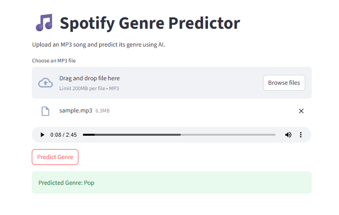

## Application Preview

# 🎵 Spotify Genre Predictor

An end-to-end Machine Learning project that predicts the genre of a song from an uploaded MP3 file.

## Project Overview

This project uses:

* VGGish Audio Embeddings
* Random Forest Classifier
* FastAPI Backend
* Streamlit Frontend

The system accepts an MP3 file, extracts audio embeddings using Google's VGGish model, and predicts the most likely music genre.

---

## Dataset

Dataset used:

490K Spotify Song Audio Embeddings & Metadata

Contains:

* 491,632 songs
* Audio embeddings
* Song metadata
* Lyrics
* Genre labels
* Artist information

Genres:

* Rock
* Pop
* Electronic
* Folk
* Country
* Hip-Hop
* R&B
* Jazz
* Blues
* Classical

---

## Machine Learning Pipeline

### 1. Exploratory Data Analysis (EDA)

Performed:

* Missing value analysis
* Genre distribution analysis
* Correlation analysis
* Popularity analysis
* Feature importance analysis

### 2. Feature Engineering

Used:

* VGGish Embeddings (128 dimensions)

### 3. Model Training

Model:

* Random Forest Classifier

Workflow:

Train/Test Split

↓

Model Training

↓

Evaluation

↓

Model Persistence

---

## Application Workflow

MP3 Upload

↓

Librosa Audio Loading

↓

VGGish Embedding Extraction

↓

Random Forest Prediction

↓

Genre Output

---

## Tech Stack

Python

Pandas

NumPy

Scikit-Learn

TensorFlow

TensorFlow Hub

Librosa

FastAPI

Streamlit

Joblib

---

## Results

Successfully predicts genres from previously unseen MP3 files.

Example:

Input:
A Thousand Years - Christina Perri

Prediction:
Pop

---

## Future Improvements

* Neural Network based classifier
* XGBoost comparison
* Multi-label genre prediction
* Artist similarity recommendation system
* Cloud deployment
* Real-time audio analysis

---

## Learning Outcomes

This project helped understand:

* Exploratory Data Analysis
* Machine Learning workflows
* Audio embeddings
* Model evaluation
* Overfitting analysis
* API development
* Frontend integration
* ML deployment concepts
